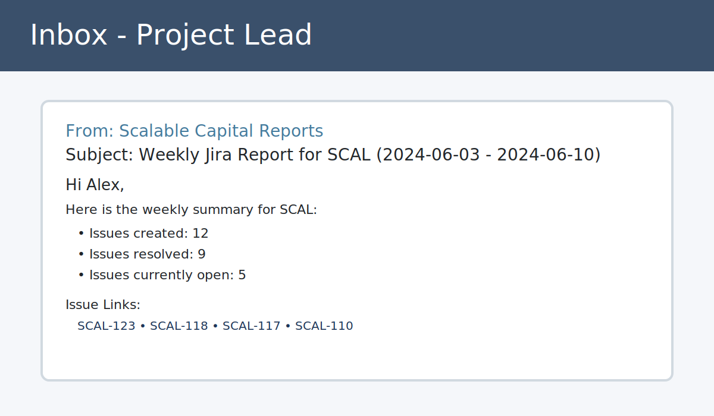

# Jira Weekly Reporting Automation

This guide walks a Jira administrator through building an automated weekly report for the Scalable Capital Jira Cloud instance (`https://scalablegermany.atlassian.net`). The solution uses the Jira REST API, a Python reporting script, and a scheduled AWS Lambda function to deliver email summaries every Monday at 10:00 AM.

The document is intentionally prescriptive so that a technically proficient teammate with no Jira background can reproduce the workflow.

---

## 1. Assumptions

* You have Jira **Site Administrator** permissions.
* You can create and manage Jira API tokens for the service account `jira.service@scalable-capital.example`.
* You own (or can request) an SMTP inbox for sending reports (e.g., `svc-report@scalable-capital.example`).
* AWS is available for running infrastructure (one Lambda function and an EventBridge rule). Substitute services are acceptable if they provide: a scheduler, outbound HTTPS, and SMTP connectivity.

---

## 2. Tools and Services

| Tool / Service | Purpose |
| --- | --- |
| Jira Cloud REST API | Query project issues, counts, and metadata. |
| Python 3.10+ with `requests` | Generates HTML report and calls Jira. |
| AWS Lambda (Python runtime) | Runs the script on a schedule. |
| AWS EventBridge | Triggers Lambda every Monday at 10:00 (Europe/Berlin). |
| AWS Secrets Manager | Stores Jira and SMTP credentials securely. |
| Company SMTP relay | Sends the email to the project lead. |

Optional (for local dry-runs): install Python dependencies with `pip install -r requirements.txt` if you split `requests` to a requirements file.

---

## 3. Jira Configuration Steps

1. **Create the Jira project**
   1. Navigate to *Projects → Create project*.
   2. Choose *Software → Scrum* template.
   3. Name the project **Scalable Capital Platform** with key **SCAL**.
   4. Assign the project lead to **Alex Fischer** (`project.lead@scalable-capital.example`).
2. **Create service account** (if it does not exist)
   1. Add the user `jira.service@scalable-capital.example` as a Jira user with the *Jira Software* product role.
   2. Add the account to the *jira-administrators* group so it can read all project issues.
3. **Generate Jira API token**
   1. Log in as the service account and open <https://id.atlassian.com/manage/api-tokens>.
   2. Click **Create API token**, name it `Weekly Reports`, and copy the token securely.
4. **Verify JQL access**
   1. Open *Filters → Advanced issue search*.
   2. Run the JQL `project = SCAL ORDER BY created DESC` using the service account to confirm permissions.

---

## 4. Repository Layout

```
jira-test-assignment/
├── .env.example                # Local development environment variables
├── README.md                   # This document
├── scripts/
│   └── jira_weekly_report.py   # Python script that talks to Jira & SMTP
└── docs/
    └── sample-email.svg        # Mock email screenshot for the deliverable
```

---

## 5. Python Reporting Script

`scripts/jira_weekly_report.py` contains the production code. It:

* Authenticates with Jira using Basic Auth (`email:token`).
* Builds three JQL queries for created, resolved, and open issues in a configurable window.
* Renders an HTML email with hyperlinks to each issue (`https://scalablegermany.atlassian.net/browse/<ISSUE>`).
* Sends the message through SMTP with TLS.
* Supports overrides via CLI flags: `--days`, `--filters`, and `--dry-run`.
* Implements defensive error handling around configuration, network calls, and SMTP interactions.

```bash
python scripts/jira_weekly_report.py --dry-run --days 7 --filters "issuetype = Bug AND priority in (High, Highest)"
```

**Environment variables** (copy `.env.example` to `.env` and fill in):

| Variable | Description |
| --- | --- |
| `JIRA_BASE_URL` | Base Jira Cloud URL (`https://scalablegermany.atlassian.net`). |
| `JIRA_PROJECT_KEY` | Project key (`SCAL`). |
| `JIRA_AUTH_EMAIL` | Jira service account email. |
| `JIRA_API_TOKEN` | Token generated in §3. |
| `JIRA_VERIFY_SSL` | `true` (default) or `false`. |
| `SMTP_HOST` / `SMTP_PORT` | SMTP relay details. |
| `SMTP_USERNAME` / `SMTP_PASSWORD` | Credentials for SMTP auth. |
| `SMTP_SENDER` | Display name + email. |
| `SMTP_RECIPIENT` | Project lead’s email. |
| `SMTP_USE_TLS` | Enable STARTTLS handshake (`true` by default). |

> **Customisation bonus**: the `--days` and `--filters` CLI options support alternate reporting windows (e.g., 30-day trend) and fine-grained filters (`issuetype`, `priority`, labels, etc.). The Lambda schedule can also be duplicated for monthly reports by attaching multiple EventBridge rules to the same function.

---

## 6. AWS Infrastructure

The minimal infrastructure uses serverless components:

```
+-------------------+      EventBridge Rule      +---------------------+
|                   |  (cron(0 8 ? * MON *) )    |                     |
| AWS EventBridge   +--------------------------->+  AWS Lambda (Py3.10) |
|                   |                            |  - Loads secrets     |
+-------------------+                            |  - Calls Jira REST   |
                                                |  - Sends SMTP email  |
                                                +----------+----------+
                                                           |
                                                           |
                                              +------------v-----------+
                                              |   Company SMTP Relay   |
                                              +------------+-----------+
                                                           |
                                              +------------v-----------+
                                              |  Project Lead Mailbox  |
                                              +------------------------+
```

* **EventBridge rule**: `cron(0 8 ? * MON *)` fires every Monday at 08:00 UTC (10:00 Berlin time, adjust if daylight saving should be honoured via Europe/Berlin timezone on rule).
* **Lambda handler**: A thin wrapper that loads secrets from AWS Secrets Manager, sets environment variables, and invokes `jira_weekly_report.main()`.
* **Networking**: Lambda runs in a private subnet with outbound internet (NAT Gateway) or public subnet with security group allowing outbound HTTPS (443) to Atlassian and SMTP port 587 to your relay.
* **Permissions**: IAM role with `secretsmanager:GetSecretValue` and CloudWatch logs write access.

---

## 7. Lambda Deployment Steps

1. **Package code**
   1. Copy `scripts/jira_weekly_report.py` into a deployment bundle (e.g., `lambda_function.py` that imports and calls `main`).
   2. Include `requests` in the bundle (`pip install requests -t ./package`).
   3. Zip the folder and upload to Lambda (`aws lambda update-function-code`).
2. **Create Secrets Manager entries**
   * `scal-jira-reporting` JSON payload:
     ```json
     {
       "JIRA_BASE_URL": "https://scalablegermany.atlassian.net",
       "JIRA_PROJECT_KEY": "SCAL",
       "JIRA_AUTH_EMAIL": "jira.service@scalable-capital.example",
       "JIRA_API_TOKEN": "<token>",
       "SMTP_HOST": "smtp.mailprovider.example",
       "SMTP_PORT": "587",
       "SMTP_USERNAME": "svc-report@scalable-capital.example",
       "SMTP_PASSWORD": "<password>",
       "SMTP_SENDER": "Scalable Capital Reports <svc-report@scalable-capital.example>",
       "SMTP_RECIPIENT": "Project Lead <project.lead@scalable-capital.example>",
       "SMTP_USE_TLS": "true"
     }
     ```
3. **Author Lambda wrapper (`lambda_function.py`)**
   ```python
   import json
   import os

   import boto3

   from jira_weekly_report import main

   secrets_client = boto3.client("secretsmanager")


   def load_env_from_secret(secret_id: str) -> None:
       payload = secrets_client.get_secret_value(SecretId=secret_id)
       data = json.loads(payload["SecretString"])
       for key, value in data.items():
           os.environ[key] = value


   def handler(event, context):
       load_env_from_secret(os.environ["JIRA_SECRET_ID"])
       return {"statusCode": 200, "body": main(["--days", "7"]) }
   ```
4. **Configure Lambda**
   * Runtime: Python 3.10
   * Environment variable: `JIRA_SECRET_ID=scal-jira-reporting`
   * Timeout: 1 minute
   * Memory: 256 MB
5. **Create EventBridge rule**
   * Schedule expression: `cron(0 8 ? * MON *)`
   * Target: the Lambda function (enable retry with DLQ for resilience).
6. **Test**
   * Manually trigger the Lambda function once via the console to confirm the email is delivered.
   * Enable the EventBridge rule.

---

## 8. Sample Output

The report email renders like the following mock (SVG) screenshot. Issue keys are clickable hyperlinks in the real email.



The HTML body produced by a dry-run contains accessible hyperlinks:

```html
<h2>Weekly Jira Project Summary</h2>
<ul>
  <li>Issues created: <strong>12</strong></li>
  <li>Issues resolved: <strong>9</strong></li>
  <li>Issues currently open: <strong>5</strong></li>
</ul>
<h3>Issue Links</h3>
<p><strong>Created issues</strong>:</p>
<ul><li><a href="https://scalablegermany.atlassian.net/browse/SCAL-123">SCAL-123</a></li></ul>
```

---

## 9. Error Handling Strategy (Bonus)

* **Configuration validation**: Script aborts if mandatory environment variables are missing.
* **HTTP resilience**: Jira requests use 30s timeout and raise descriptive errors on non-200 responses.
* **SMTP safety**: Exceptions from the SMTP client are logged and cause a non-zero exit code; configure Lambda retries or alerts on failure.
* **Structured logging**: Log lines include timestamps and level for ingestion into CloudWatch.

---

## 10. Extending the Solution (Bonus)

* Use the `--filters` switch to run `priority >= High` or `issuetype in (Bug, Incident)` reports.
* Add CSV attachments by extending `build_email_body` and using `EmailMessage.add_attachment`.
* Store historical metrics in DynamoDB for trend dashboards.

---

## 11. Command Reference

```bash
# Local dry-run with custom filters
export $(grep -v '^#' .env | xargs) && python scripts/jira_weekly_report.py --dry-run

# Deploy Lambda package
zip -r jira-report.zip scripts/jira_weekly_report.py lambda_function.py requests/
aws lambda update-function-code --function-name jira-weekly-report --zip-file fileb://jira-report.zip

# Test Lambda manually
aws lambda invoke --function-name jira-weekly-report response.json
```

---

## 12. Maintenance Checklist

* Rotate the Jira API token quarterly; update the secret.
* Monitor Lambda errors via CloudWatch alarm.
* Review EventBridge schedule after daylight saving changes.
* Audit SMTP deliverability (SPF/DKIM) annually.

